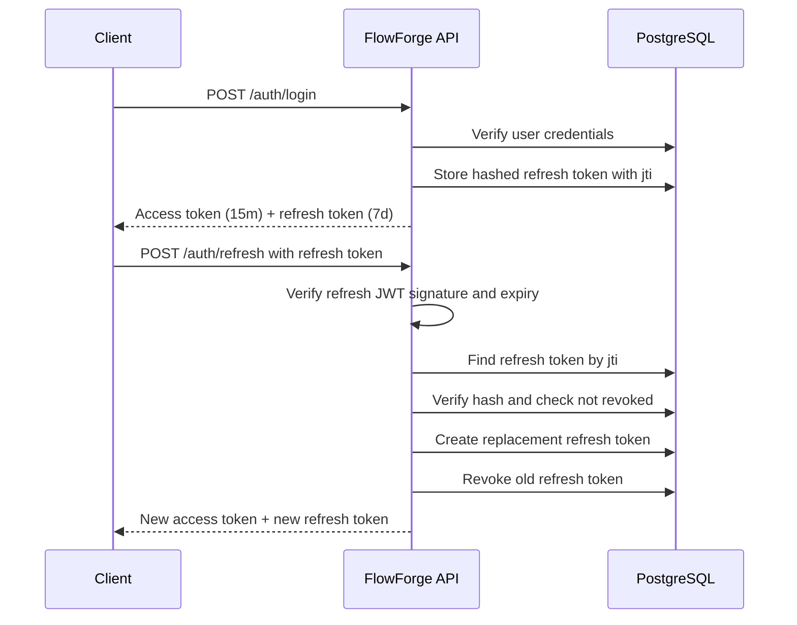
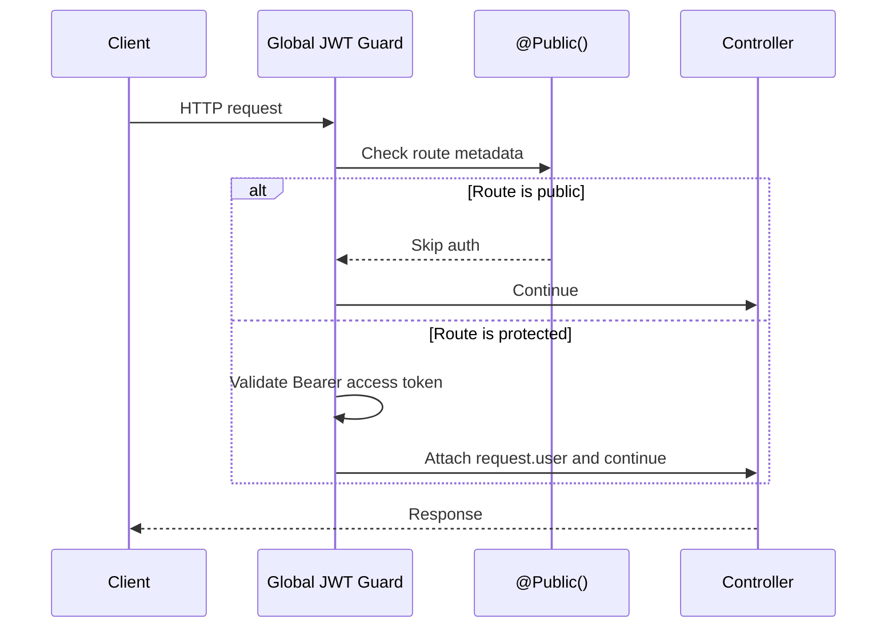

# FlowForge Auth

## Why JWT + Refresh Tokens Instead of Sessions

FlowForge uses short-lived JWT access tokens with longer-lived refresh tokens because the API is designed to be stateless at the request boundary. A valid access token lets any API instance authenticate a request without reading a central session store on every call, which is helpful when the service scales horizontally.

Refresh tokens restore server-side control. They are stored hashed in PostgreSQL, can be revoked on logout, and are rotated every time they are used. This gives the client a smooth login experience without keeping access tokens alive for days.

Traditional server sessions are still a strong choice for many web apps, especially browser-only products, but they require a shared session store and usually make mobile/API clients a little more coupled to server state. FlowForge keeps access checks fast while reserving database reads for refresh and logout.

## Token Rotation Flow

## If a Refresh Token Is Stolen

If an attacker steals a refresh token before the real user refreshes, the attacker may be able to exchange it once. Token rotation limits the damage because the stolen token is revoked as soon as it is used.

If the real user later tries to use the old token, the API rejects it because it is already revoked. In a production hardening pass, that reuse signal should revoke the whole refresh-token family and force the user to log in again.

## Request Flow

## Interview Questions

1. Why should access tokens be short-lived when refresh tokens exist?
2. Why should refresh tokens be stored hashed in the database?
3. What security problem does refresh token rotation reduce?
4. How does a global guard know which routes are public in NestJS?
5. What should happen if a revoked refresh token is used again?
